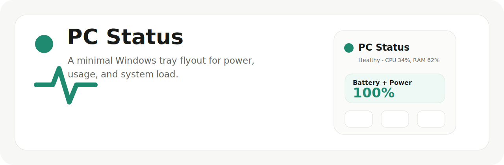
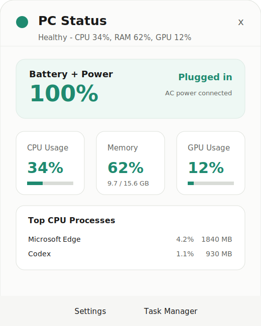
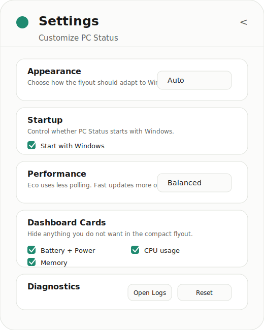
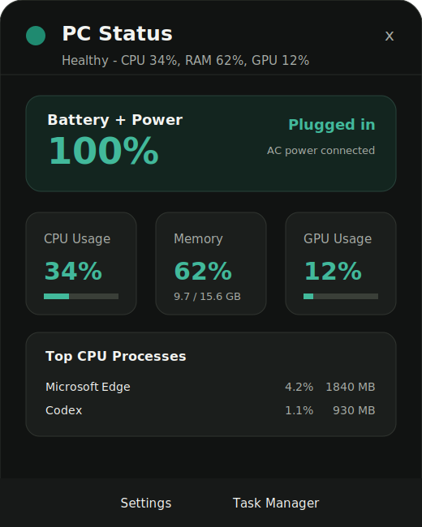
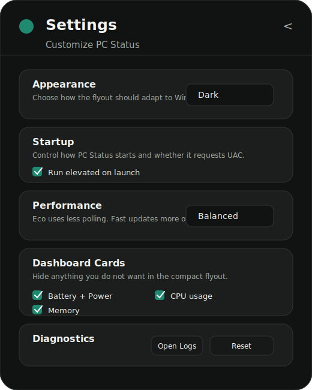

# PC Status

PC Status is a small Windows tray widget with a clean OneDrive-style flyout. It shows power state, system load, usage cards, and top CPU processes without opening a full dashboard window.

The app is built with PowerShell 5.1, WinForms, and WPF. No .NET SDK build step is required.

## Preview

| Main flyout | Settings |
| --- | --- |
|  |  |

Dark mode:

| Main flyout | Settings |
| --- | --- |
|  |  |

## Features

- Tray icon opens a compact flyout above the taskbar.
- Battery and power status hero card.
- CPU, memory, and GPU usage cards.
- Top CPU process list with CPU and memory usage.
- Light, Dark, and Auto theme modes.
- Per-card visibility toggles.
- Eco, Balanced, and Fast refresh presets.
- Optional start with Windows.
- Detailed or minimal tray tooltip.
- Missing metrics render as `Unavailable` instead of crashing.

## Run

```powershell
powershell.exe -NoProfile -ExecutionPolicy Bypass -File .\src\WindowsDashboard.ps1
```

The app adds a tray icon. Click the icon to open or hide the flyout.

PC Status does not require administrator access for its current battery, usage, GPU, process, and settings features.

Settings are stored at:

```text
%LOCALAPPDATA%\PCStatus\settings.json
```

## Settings

- `Appearance`: Light, Dark, or Auto theme.
- `Startup`: start with Windows.
- `Performance`: Eco, Balanced, or Fast refresh preset.
- `Dashboard Cards`: show or hide Battery + Power, CPU, Memory, GPU, and Top Processes.
- `Tray`: detailed or minimal tray tooltip.
- `Diagnostics`: open logs, reset defaults, or quit.

## Tests

```powershell
powershell.exe -NoProfile -ExecutionPolicy Bypass -File .\tests\HealthModel.Tests.ps1
powershell.exe -NoProfile -ExecutionPolicy Bypass -File .\tests\AppSettings.Tests.ps1
powershell.exe -NoProfile -ExecutionPolicy Bypass -File .\tests\SystemStats.Tests.ps1
powershell.exe -NoProfile -ExecutionPolicy Bypass -File .\tests\StatsWorker.Smoke.Tests.ps1
```

Parser and UI validation:

```powershell
powershell.exe -NoProfile -ExecutionPolicy Bypass -Command "& { Get-ChildItem -Recurse -Filter *.ps1 | ForEach-Object { `$tokens=`$null; `$parseErrors=`$null; [System.Management.Automation.Language.Parser]::ParseFile(`$_.FullName, [ref]`$tokens, [ref]`$parseErrors) > `$null; if (`$parseErrors) { Write-Output `$_.FullName; `$parseErrors | ForEach-Object { `$_.ToString() }; exit 1 } }; Write-Output OK }"
powershell.exe -NoProfile -ExecutionPolicy Bypass -File .\src\WindowsDashboard.ps1 -ValidateOnly
```
